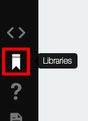
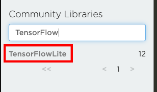
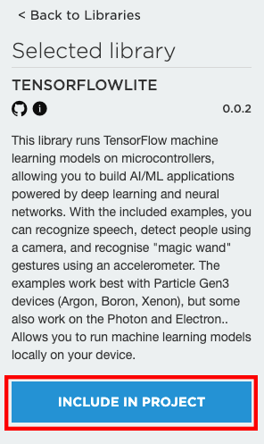
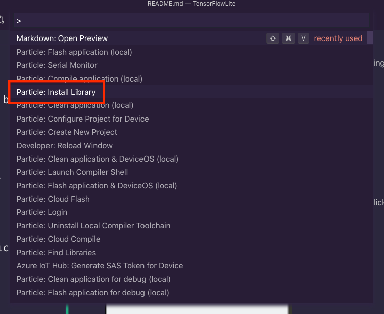

# TensorFlowLite

A library for using [TensorFlow Lite for Microcontrollers](https://www.tensorflow.org/lite/microcontrollers) with Particle devices. This library has been tested with the following Particle devices:

- Photon / P1
- Argon
- Boron
- Xenon

**NOTE**: While the TensorFlow Library itself has been tested with all of the devices above, not every example below runs on all of these devices. Model size if the main constraint here, so check the model size if you're having issues running an project.

## Getting started with TensorFlow Lite

To use TensorFlow Lite for Microcontrollers with your own models, you'll need to take the following steps, as detailed in the [TensorFlow docs](https://www.tensorflow.org/lite/microcontrollers#developer_workflow):

1. Create or download a model.
2. Convert the model to a a TensorFlow Lite FlatBuffer.
3. Convert the FlatBuffer to a C byte array for inclusion in your project.
4. Integrate this library into your project using the instructions below.
5. Deploy your project to a Particle device.

For a complete walkthrough of the steps above, you can view one of the exercises in the TensorFlow docs, or check out the [README for the linear_regression example](/examples/linear_regression/README.md) for a step-by-step example of the model creation to MCU execution process.

## Installation

This library is available for use on all Particle devices and can be installed using one of the following approaches.

### 1. Installing in the Particle Web IDE

To install this libraries from the [Web IDE](https://build.particle.io), open the libraries tab by clicking on the bookmark icon on the lower left of the screen.



Then, in the Community Libraries search box, type "TensorFlow" and click on the `TensorFLowLite` entry.



Finally, click the "Include in Project" button and follow the prompts to pick the project in which to install this library.



### 2. Installing in Particle Workbench

If you're using Particle Workbench, first open the project you want to use with TensorFlow Lite. Then, open the Command Palette by typing CMD+SHIFT+P (macOX/Linux) or CTRL+SHIFT+P (Windows).



Search for the "Particle: Install Library" option and click it.


Type "TensorFlowLite" and hit enter. Workbench will install the library into a `lib` directory at the root of your project and notify you when complete.


### 3. Installing with the Particle CLI

To install this library using the [Particle CLI](https://docs.particle.io/tutorials/developer-tools/cli/), run the following command from a Particle project directory.

```bash
$ particle library install TensorFlowLite

Checking library TensorFlowLite...
Installing library TensorFlowLite 0.1.0 to /Users/bsatrom/Particle/community/libraries/TensorFlowLite@0.1.0 ...
Library TensorFlowLite 0.1.0 installed.
```

## Using the library

See the [TensorFlow Lite for Microcontrollers docs](https://www.tensorflow.org/lite/microcontrollers/get_started#how_to_run_inference) for detailed instructions on running inference on embedded devices.

## Included Examples

The source contains the following examples, some of which require additional hardware and may not run across all Particle devices (especially the Photon) due to model size constraints.

1. `linear_regression` - Runs a simple linear regression model (~1kb in size) to solve for the canonical "straight line equation" `y = mx + c` given random `x` values between 0 and 1. Outputs the result to an [Adafruit 3.5" TFT FeatherWing](https://www.adafruit.com/product/3651). This example project also contains [complete instructions](/examples/linear_regression/README.md) that illustrate the process of building a model from scratch in TensorFlow and Keras, converting that model to TFLite and then a FlatBuffer format, and finally, building a project to execute that model on Particle MCUs. Tested on the Particle Photon and Xenon.
2. `hello_world` - Runs a simple sine wave model (2kb in size) to predict the next wave position. Uses the output to `analogWrite` the waveform value to the onboard D7 LED. Tested on the Particle Photon and Xenon.
3. `sine_with_screen` - Runs the same sine wave model from the `hello_world` project, and outputs the result to an [Adafruit 3.5" TFT FeatherWing](https://www.adafruit.com/product/3651). Can easily be adapted to other displays.
4. `micro_speech` - Runs a speech detection model (18k in size) that can recognize the words "yes" and "no." Uses the output to flash the onboard D7 LED when "yes" is detected. Requires an [electret microphone amplifier](https://www.adafruit.com/product/1713). This example is only supported on Particle 3rd gen devices (Argon, Boron, Xenon).
5. `magic_wand` - Runs a gesture detection model (18k in size) that can recognize 3 gestures: "wing" (draw a W from left to right), "ring" (draw a circle clockwise from top), and "slope" (draw two-sides of a triangle from top right). This example is only supported on Particle 3rd Gen devices (Argon, Boron, Xenon).
6. `person_detection` - Runs a person detection model (250k in size) that can detect a person in an image from a connected camera. Requires the [ArduCam](https://www.arducam.com/product/arducam-2mp-spi-camera-b0067-arduino/) and dependent libraries. *NOTE*: This demo has been ported, but cannot currently be run on Particle devices as the model overflows available flash space significantly. 