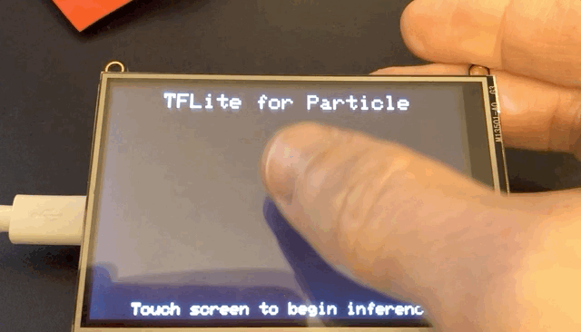

# Linear Regression with Particle and TensorFlow Lite

An end-to-end example of the process of creating MCU-friendly models. This example illustrates the complete process including: 

1. [Training a simple linear regression model with TensorFlow and Keras](#training-the-model).
2. [Converting that model to the TensorFlow Lite FlatBuffer format](#converting-the-tensorflow-model-to-tflite).
3. [Converting the TFLite FlatBuffer model to a C byte array](#creating-an-mcu-friendly-representation-of-the-model).
4. [Performing inference with the model on a Particle 3rd Gen device (Xenon) using TensorFlow Lite for Microcontrollers](#performing-inference-on-particle-devices).
5. [Displaying the results on a connected TFT Display](#displaying-the-results).

The end result is Machine Learning on an embedded device!



## Training the model

For this example, we'll create a model that helps our machine learn the equation `y = mx + c`. This is, of course, a contrived example, but we've chosen something simple to keep the focus on the process of going from model to MCU, not on the model training process itself.

The steps below walk through the process of creating the model at a high-level. For detailed instructions, view the [Jupyter notebook source](model/linear_regression.ipynb) or this [online Colab notebook from Google](https://colab.research.google.com/github/tensorflow/examples/blob/master/courses/udacity_intro_to_tensorflow_lite/tflite_c01_linear_regression.ipynb).

In Keras, we can use the following few lines of Python to create our model.

```python
x = [-1, 0, 1, 2, 3, 4]
y = [-3, -1, 1, 3, 5, 7]

model = tf.keras.models.Sequential([
    tf.keras.layers.Dense(units=1, input_shape=[1])
])
model.compile(optimizer='sgd', loss='mean_squared_error')
model.fit(x, y, epochs=200, verbose=1)
```

Once we've trained the model (via the `fit` command), we'll want to generate a saved model file

```python
export_dir = 'saved_model/'
tf.saved_model.save(model, export_dir)
```

## Converting the TensorFlow Model to TFLite

TensorFlow provides a built-in converter for taking full TF models and outputting TFLite models that can be used in mobile and embedded devices. Assuming you have a saved model file on hand, this process is pretty simple.

```python
converter = tf.lite.TFLiteConverter.from_saved_model(export_dir)
tflite_model = converter.convert()

tflite_model_file = pathlib.Path('model.tflite')
tflite_model_file.write_bytes(tflite_model)
```

Once you've created a TFLite model, you're ready to move to your Particle device!

**Note**: The [Jupyter notebook source](model/linear_regression.ipynb) for this example also contains instructions for testing out your TFLite model and running inference using the Python TFLite interpreter. If you're creating your own models, we recommend doing this before moving onto an MCU.

## Creating an MCU-friendly representation of the model

Many MCU's (including Particle devices) do not have native filesystem support, which means you'll need to load your TFLite model into memory in order to use it. The recommended way to do this is to convert your model into a C array and compile it into your project.

On Linux or macOS, you can do this with the `xxd` command.

```bash
xxd -i linear_regression_model.tflite > linear_regression_model_data.cpp
```

## Performing inference on Particle Devices

Once you have a MCU-friendly model in hand, you're ready to use it. You first want to install and configure TFLite for your project.

### Configuring TFLite for inference

1. To use TFLite in Particle projects, you'll need the `TensorFlowLite` library, which you can install using the [instructions in the main README](../../README.md) for this repo.

2. Once you have installed the library, you'll want to include the following header files at the top of your project source.

```cpp
#include "tensorflow/lite/experimental/micro/kernels/all_ops_resolver.h"
#include "tensorflow/lite/experimental/micro/micro_error_reporter.h"
#include "tensorflow/lite/experimental/micro/micro_interpreter.h"
#include "tensorflow/lite/schema/schema_generated.h"
#include "tensorflow/lite/version.h"
```

3. Next, include the C array version of your model you created previously

```cpp
#include "linear_regression_model_data.h"
```

4. Then, you'll want to set-up a few objects to handling logging for us.

```cpp
tflite::MicroErrorReporter micro_error_reporter;
tflite::ErrorReporter* error_reporter = &micro_error_reporter;
```

5. Now, we'll load the model into memory, and make sure the schema versions match.

```cpp
const tflite::Model *model = tflite::GetModel(g_linear_regresion_model_data);
if (model->version() != TFLITE_SCHEMA_VERSION)
{
  error_reporter->Report(
    "Model provided is schema version %d not equal "
    "to supported version %d.",
    model->version(), TFLITE_SCHEMA_VERSION);
  return;
}
```

6. Once we've loaded a model, the next step is to instantiate an operations (or ops) resolver, which loads the operations a model will need for inferencing. In this case, we're using the `AllOpsResolver`, which is not recommended for production use, but it fine for our simple example.

```cpp
static tflite::ops::micro::AllOpsResolver resolver;
```

7. Next, we'll need to preallocate some memory for input, outputs and inferencing. For non-trivial models, you'll need to experiment with this value to make sure its large enough for runtime inferencing.

```cpp
constexpr int kTensorArenaSize = 2 * 1024;
uint8_t tensor_arena[kTensorArenaSize];
```

8. Now, we'll instantiate an interpreter to manage inferencing and allocate needed memory with the `AllocateTensors` method.

```cpp
tflite::MicroInterpreter interpreter(model, resolver, tensor_arena,
                                     kTensorArenaSize, error_reporter);
TfLiteStatus allocate_status = interpreter->AllocateTensors();
```

9. Finally, we'll grab pointers to our model's input and output tensors. Make sure to place these into global objects so you can access them at runtime.

```cpp
// Declare these outside of setup
TfLiteTensor *input = nullptr;
TfLiteTensor *output = nullptr;

// Assigned in setup
input = interpreter->input(0);
output = interpreter->output(0);
```

### Performing inference

Now for the fun-part, inference! In this example project, inference is triggered when a user taps on a TFT touch screen. Once triggered, the application performs inference 100 times, passing a random `x` value between 0 and 1 into the model each time, invoking the model and obtaining the `y` result. After each run, the input (`x`) and output (`y`) values are output to the serial console.

1. The first step is to provide TFLite with an input value. I created a `randFloat` function to give me a float value between 0 and 1, and then set the result on the input tensor of the model.

```cpp
float randFloat(float min, float max)
{
  return ((max - min) * ((float)rand() / RAND_MAX)) + min;
}

// In loop
float x_val = randFloat(0, 1);
input->data.f[0] = x_val;
```
2. Next, we'll run our input through the model by calling the interpreter's `Invoke` command and checking the result.

```cpp
TfLiteStatus invoke_status = interpreter->Invoke();

if (invoke_status != kTfLiteOk)
{
  error_reporter->Report("Invoke failed on x_val: %f\n",
                          static_cast<double>(x_val));
  return;
}
```
3. If everything worked, we can grab the inferred `y` value from the output tensor.

```cpp
float y_val = output->data.f[0];
```

4. Finally, we can log the input and output values to the Serial console to see how things look.

```bash
X Value: 0.14
Y Value: -0.52

X Value: 0.85
Y Value: 0.85

X Value: 0.71
Y Value: 0.57

X Value: 0.31
Y Value: -0.18

X Value: 0.96
Y Value: 1.07
```

## Displaying the Results

You can run everything in the example up to this point with no additional hardware. If you want to run the complete example, including the fancy graphical display above, you'll need an [Adafruit 3.5" TFT FeatherWing](https://www.adafruit.com/product/3651). Once you have that, you can refer to the [example source](src/linear_regression.cpp) to see how to configure the screen for use. 

Before inferencing, I frame the output by drawing a couple of white lines on the screen to serve as x and y axes for my outputs.

```cpp
tft.drawFastVLine(10, 10, 300, HX8357_WHITE);
tft.drawFastHLine(10, 310, 460, HX8357_WHITE);
```

Then, after each inference, I'll plot the result on the display, with my input as the x coordinate and output as the y. My x values range from 0 to 1 and y from -1 to 1, so I'll need to do a bit of translation to get these positioned properly on the TFT screen, which is 480x320. I can use the map function to effectively spread the values out on a larger range for display.

```cpp
float xPos = map(x_val, 0.f, 1.f, 20.f, 460.f);
float yPos = map(y_val, -1.f, 1.f, 330.f, 50.f);
```

Then, all that's left is to call the `fillCircle` method on my display to add a dot after each inference. It's so fast in the video above that I grabbed another version in slow-motion just so you can see the magic happen!

